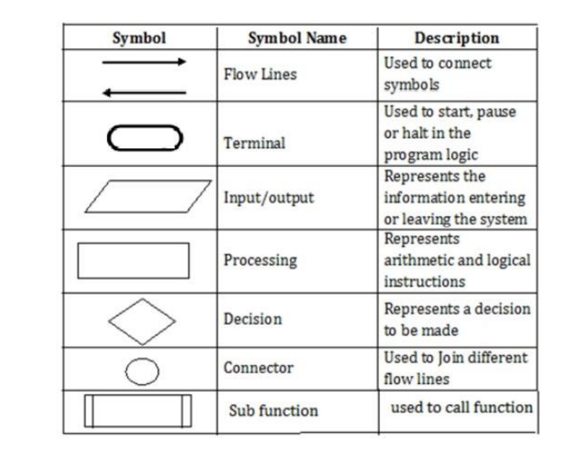

# Understanding Algorithms

An **algorithm** is a step-by-step process that describes how to solve a problem in a way that always gives a correct answer. When there are multiple algorithms for a particular problem (and there often are!), the best algorithm is typically the one that solves it the fastest.

As computer programmers, we are constantly using algorithms, whether it's an existing algorithm for a common problem, like sorting an array, or if it's a completely new algorithm unique to our program. By understanding algorithms, we can make better decisions about which existing algorithms to use and learn how to make new algorithms that are correct and efficient.

An algorithm is made up of three basic building blocks:

1. **Sequencing**
2. **Selection**
3. **Iteration**

## Sequencing

An algorithm is a step-by-step process, and the order of those steps is crucial to ensuring the correctness of an algorithm.

## Selection

Algorithms can use selection to determine a different set of steps to execute based on a Boolean expression.

## Iteration

Algorithms often use repetition to execute steps a certain number of times or until a certain condition is met.

[key-answer pdf file](key-answer.pdf)
