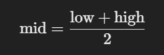

# TOPICS

## `square root`

## `GCD`

Brute force approach

```python
def find_gcd(x, y):
    gcd = min(x, y)  # Start with the smaller of the two numbers
    
    while True:
        if x % gcd == 0 and y % gcd == 0:
            return gcd
        gcd -= 1  # Decrement and check for the next possible divisor

# Example usage
num1 = int(input("Enter the first number: "))
num2 = int(input("Enter the second number: "))

gcd = find_gcd(num1, num2)
print("GCD:", gcd)

```

Euclidean algorithm is preferred for efficiency

```python
def find_gcd(a, b):
    while b != 0:
        a = b
        b = a % b
    return a

x = int(input("Enter the value for x: "))
y = int(input("Enter the value for y: "))
print("gcd:", find_gcd(x, y))

```

## `LCM`

Brute force approach

- Brute force is nothing but, applying exactly same logic.
- Without using any optimizing technic.

```python
def find_lcm(x, y):
    lcm = max(x, y)
    
    while True:
        if lcm % x == 0 and lcm % y == 0:
            return lcm
        lcm += 1

# Example usage
num1 = int(input("Enter the first number: "))
num2 = int(input("Enter the second number: "))

lcm = find_lcm(num1, num2)
print("LCM:", lcm)
```

The optimized solution for finding the **LCM (Least Common Multiple)** uses the formula:


Here’s the Python implementation using this formula:

```python
def find_gcd(a, b):
    # Euclidean algorithm to find GCD
    while b != 0:
        a, b = b, a % b
    return a

def find_lcm(a, b):
    gcd = find_gcd(a, b)  # Calculate GCD
    return abs(a * b) // gcd  # Use the LCM formula

# Example usage
num1 = int(input("Enter the first number: "))
num2 = int(input("Enter the second number: "))

lcm = find_lcm(num1, num2)
print("LCM:", lcm)
```

### Explanation

1. **GCD Calculation**:
   - Uses the **Euclidean algorithm**, which is efficient for finding the GCD of two numbers.

2. **LCM Formula**:
   - The relationship between LCM and GCD ensures we only need one iteration to calculate the LCM.

3. **Absolute Value**:
   - `abs(a * b)` handles any negative numbers, ensuring the result is positive.

---

### Example Execution

For `num1 = 12` and `num2 = 15`:

1. GCD = 3 (calculated using the Euclidean algorithm).
2. LCM = \(\frac{12 \times 15}{3} = 60\).
3. Output: `LCM: 60`.

---

This solution is much faster and avoids unnecessary iterations compared to the brute force method, making it suitable for larger numbers.

## `square root`

```python
import math
num1 = float(input("Enter the first number: "))
num2 = float(input("Enter the second number: "))
num3 = float(input("Enter the third number: "))
sqrt1 = math.sqrt(num1)
sqrt2 = math.sqrt(num2)
sqrt3 = math.sqrt(num3)
print(f"The square root of {num1} is {sqrt1}")
print(f"The square root of {num2} is {sqrt2}")
print(f"The square root of {num3} is {sqrt3}")

```

```python
num1 = float(input("Enter the first number: "))
num2 = float(input("Enter the second number: "))
num3 = float(input("Enter the third number: "))
sqrt1 = num1**0.5
sqrt2 = num2**0.5
sqrt3 = num3**0.5
print(f"The square root of {num1} is {sqrt1}")
print(f"The square root of {num2} is {sqrt2}")
print(f"The square root of {num3} is {sqrt3}")
```

## `sum of array of numbers`

```python
li = [4,2,3,1]
_sum = 0
n = len(li)
for i in range(n):
    _sum = _sum + li[i]
print("sum of array of numbers : ", _sum)
```

## `linear search`

Here's the given content organized in a neat, documented manner for better clarity and understanding:

---

# **Linear Search Algorithm**

## **Overview**

Linear Search is a simple searching algorithm that checks each element in a list sequentially until the desired element is found or the entire list has been traversed.

### **Steps of Linear Search**

1. **Start from the first element** of the list.
2. **Compare the current element** with the target value.
3. If the current element **matches the target**, return the **index** of the element.
4. If not, **move to the next element** and repeat the process.
5. If the target is not found by the end of the list, return **-1** (indicating the element is not present).

---

## **Code Implementation**

```python
# Function to perform Linear Search
def linear_search(arr, target):
    # Iterate through the list
    n = len(arr)
    for i in range(n):
        # If the target is found, return the index
        if arr[i] == target:
            return i
    # If target not found, return -1
    return -1

# Main program to test the linear_search function
arr = [10, 20, 30, 40, 50, 60, 70]  # Sample list
target = int(input("Enter the element to search for: "))  # Input target value

# Call the linear_search function
result = linear_search(arr, target)

# Output the result
if result != -1:
    print(f"{target} is present at index {result}.")
else:
    print(f"{target} is not present in the list.")
```

---

## **Explanation**

### **Function: `linear_search(arr, target)`**

- **Input**:
  - `arr`: The list where the element will be searched.
  - `target`: The element that needs to be found.
  
- **Steps**:
  - The function iterates over each element in the list using a `for` loop.
  - If an element matches the target, the function immediately returns the index of that element.
  - If the loop completes without finding the target, the function returns `-1` to indicate that the target is not present in the list.

### **Main Program**

- The program prompts the user to input a target value to search for in a predefined list `arr`.
- It calls the `linear_search()` function with the inputted target and predefined list.
- Based on the result returned by the function:
  - If the target is found, it prints the index where the element is located.
  - If the target is not found, it prints a message indicating that the element is not present.

---

## **Example Run**

### **Input**

```
Enter the element to search for: 40
```

### **Output**

```
40 is present at index 3.
```

### **Explanation**

- The target `40` is present in the list `arr` at index 3. The function returns `3`, and the program outputs the result.

---

# **Binary search**

Here’s a neat and documented explanation of the **Binary Search Algorithm**:

---

# **Binary Search Algorithm**

## **Overview**

Binary Search is an efficient algorithm used to find the position of a target value within a **sorted** list. The main idea behind binary search is to repeatedly divide the search interval in half. If the value of the target is less than the value in the middle of the interval, the search continues in the lower half; otherwise, it continues in the upper half.

### **Steps of Binary Search**

1. **Start with two pointers**, `low` and `high`, which represent the beginning and end of the list.
2. **Find the middle element** of the current sublist:



3. If the middle element is equal to the target, **return the index**.
4. If the middle element is greater than the target, **move the `high` pointer** to the left of the middle element (i.e., `high = middle - 1`).
5. If the middle element is less than the target, **move the `low` pointer** to the right of the middle element (i.e., `low = middle + 1`).
6. Repeat the process until the target is found or the `low` pointer exceeds the `high` pointer, indicating the target is not present.

---

## **Code Implementation**

```python
# Function to perform Binary Search
def binary_search(arr, target):
    low = 0
    high = len(arr) - 1
    
    while low <= high:
        mid = (low + high) // 2  # Calculate middle index
        
        if arr[mid] == target:
            return mid  # Return the index if the target is found
        elif arr[mid] < target:
            low = mid + 1  # Search the right half
        else:
            high = mid - 1  # Search the left half
    
    return -1  # Return -1 if the target is not found

# Example usage
arr = [10, 20, 30, 40, 50, 60, 70, 80, 90]  # Sorted list
target = int(input("Enter the element to search for: "))  # Input target value

# Call the binary_search function
result = binary_search(arr, target)

# Output the result
if result != -1:
    print(f"{target} is present at index {result}.")
else:
    print(f"{target} is not present in the list.")
```

---

## **Explanation**

### **Function: `binary_search(arr, target)`**

- **Input**:
  - `arr`: A sorted list where we will search for the target element.
  - `target`: The element that we need to find in the list.
  
- **Steps**:
  - Start with two pointers: `low` (start of the list) and `high` (end of the list).
  - **Middle Index Calculation**: The middle element is calculated using the formula:
    \[
    \text{mid} = \frac{\text{low} + \text{high}}{2}
    \]
  - If the middle element matches the target, return the index.
  - If the middle element is less than the target, search in the **right half** by updating `low` to `mid + 1`.
  - If the middle element is greater than the target, search in the **left half** by updating `high` to `mid - 1`.
  - If the target is not found, return `-1`.

### **Main Program**

- The program prompts the user to input a target value.
- It calls the `binary_search()` function with the sorted list `arr` and the target element.
- Based on the result returned by the function:
  - If the target is found, it prints the index where the element is located.
  - If the target is not found, it prints a message indicating that the element is not present.

---

## **Example Run**

### **Input**

```
Enter the element to search for: 40
```

### **Output**

```
40 is present at index 3.
```

### **Explanation**

- The target `40` is present in the sorted list at index 3. The binary search algorithm quickly finds the target by narrowing down the search space.

---
